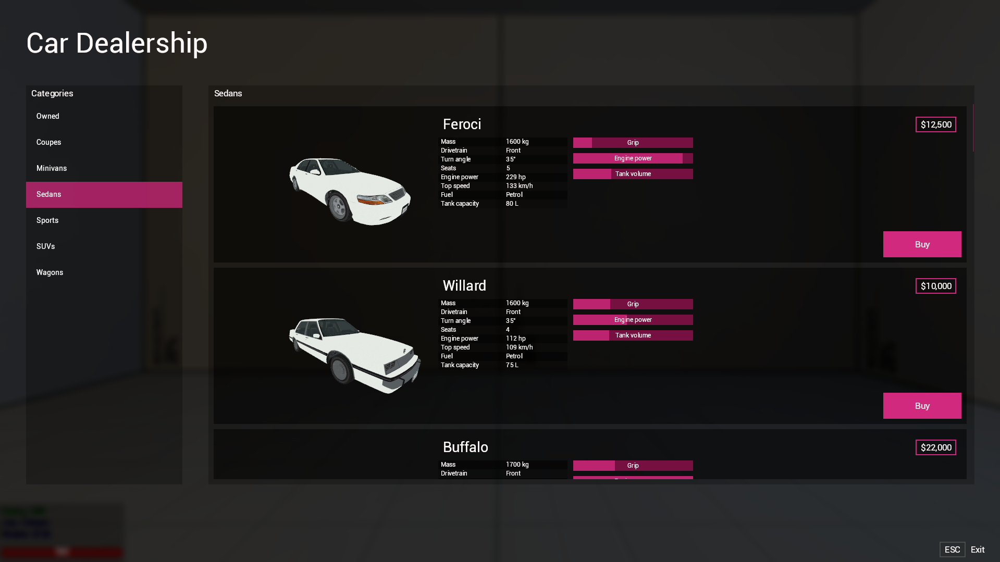

# mgd-cardealer



---

A car dealership module for **DarkRP** (Garry's Mod) built on
[**simfphys**](https://steamcommunity.com/sharedfiles/filedetails/?id=771487490) vehicles.
Players browse a 3D showroom, buy cars, store them, spawn/return them at parking spots, and
sell them back. An **optional** second‑hand market lets players resell cars to each other.

---

## Features

- **3D showroom UI** with rotatable models and a live spec sheet (mass, drivetrain, power,
  top speed, fuel, …).
- **Persistent ownership** - cars, trunks, paint colour, health, fuel,
  engine wear and damaged wheels are stored in the database and restored on spawn.
- **Parking system** - cars spawn at / are returned to the nearest free spawn point.
- **Optional second‑hand market** - disabled by default; enable it and wire your bank.
- **In‑game custom‑vehicle editor** for superadmins.

---

## Requirements

| Dependency | Why |
|---|---|
| **DarkRP** | base gamemode, `MySQLite`, money API (`canAfford` / `addMoney`) |
| **simfphys** (+ a vehicle pack, e.g. GTA IV cars) | the actual vehicles |
| **netstream** | networking library used for menus and actions |

---

## Installation

1. Drop the `mgd-cardealer` folder into
   `garrysmod/addons/`.
2. Make sure the dependencies above are installed.
3. Restart the server. Tables are created automatically on `DarkRPDBInitialized`.

Open the dealer menu by sending the `MGD.CarDealer.GetList` net message (wire it to an NPC,
a bind, or an entity). Add parking spots from the server with
`MGD.Cardealer.AddSpawnPoint(pos, ang)` or use parking spot tool.

---

## File structure

```
mgd-cardealer/
  addon.json
  README.md
  lua/
    autorun/
      mgd_cardealer.lua  loader (include + AddCSLuaFile)
    mgd_cardealer/
      sv_config.lua      server  economy, cooldowns, used-dealer toggle
      sv_money.lua       server  swappable money provider
      sv_cardealer.lua   server  catalogue (vehList), database, networking, spawning
      cl_cardealer.lua   client  showroom menu + custom-vehicle editor
      cl_panel.lua       client  scroll panel and dialog widgets
    weapons/gmod_tool/stools/
      cardealer_spawnpoint_tool.lua          parking-spot tool
```

- **Cars / prices** -> the `vehList` table at the top of `lua/mgd_cardealer/sv_cardealer.lua`.
- **Economy / cooldowns / used dealer** -> `lua/mgd_cardealer/sv_config.lua`.
- **How money is taken/given** -> `lua/mgd_cardealer/sv_money.lua`.

---

## Configuration (`sv_config.lua`)

```lua
Config.Economy   = { SellBackPercent = 75, UsedListingFee = 30, MaxUsedPrice = 100000000 }
Config.Cooldowns = { Buy = 3, Used = 5, GetList = 1, Spawn = 3, Admin = 3 }
Config.Plate     = { Letters = 3, Digits = 4 }

Config.UsedDealer = {
    Enabled = false,                              -- turn the second-hand market on/off
    Pos     = Vector(0, 0, 0),                    -- NPC position for your map
    Ang     = Angle(0, 0, 0),
    Model   = 'models/humans/group02/tale_07.mdl',
}
```

Adding a vehicle to the catalogue (in `sv_cardealer.lua`):

```lua
['Sedans'] = {
    sim_fphys_gta4_oracle = { price = 8750, camPos = Vector(-20, 0, -20) },
    -- usedCar = true  -> only sold by the second-hand NPC
},
```

---

## Money

The dealer never touches money directly - it goes through `MGD.Cardealer.Money.*`
(`sv_money.lua`). The defaults use vanilla DarkRP money:

```lua
Money.CanAfford(ply, amount)              -> bool
Money.Take(ply, amount, reason, cb)       -> cb(ok, errMsg)   -- buying / listing fee
Money.Give(ply, amount, reason, cb)       -> cb(ok, errMsg)   -- selling back to the dealer
```

### Second‑hand market money (required if you enable it)

A player‑to‑player sale needs a real transfer (the seller may be offline), so the default
**refuses** until you wire your bank. Enable `Config.UsedDealer.Enabled` **and** override:

```lua
function MGD.Cardealer.Money.UsedTransfer(buyer, sellerSteamID64, amount, reason, cb)
    -- charge `buyer`, credit the character behind `sellerSteamID64` (online or offline),
    -- then call cb(true) on success or cb(false, "reason") on failure.
    MyBank.Transfer(buyer:SteamID64(), sellerSteamID64, amount, reason, function(ok)
        cb(ok, ok and nil or "Перевод не удался.")
    end)
end
```

`MGD.Cardealer.Money.GetPlayerBySteamID64(steamid)` is provided to resolve an online player.

---

## Database (MySQL / SQLite via `MySQLite`)

| Table | Holds |
|---|---|
| `mgd_cardealer` | ownership: `steamid`, vehicle class, plate |
| `mgd_cardealer_data` | health, fuel, colour, wheel damage |
| `mgd_cardealer_usedcarslist` | active second‑hand listings (`carID`, seller `steamid`, price) |
| `mgd_cardealer_spawnpoints` | parking spots per map |
| `mgd_cardealer_custom` | superadmin‑added vehicles |

---
